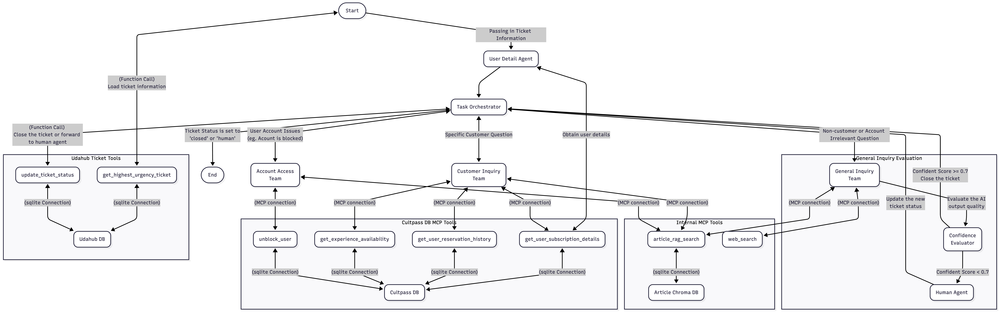

# UdaHUB - Udacity Agentic AI Engineer with LangChain and LangGraph Final Project

This project was built using LangGraph to simulate an Agnetic AI solution for a customer service system.  The architecture of the solution is shown as follow:

There are 3 MCP servers were build for each of the 3 database:
- [*_Udahub database_*](./tools/udahub_mcp_server.py): Contains all tickets informations.
- [*_Cultpass database_*](./tools/cultpass_mcp_server.py): Contains user and account information.
- [*_Article vector database_*](./tools/internal_mcp_server.py): Contain the knowledge articles and the web search function.