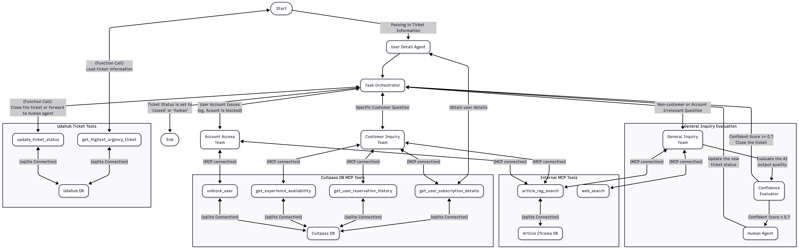

# UdaHUB - Udacity Agentic AI Engineer with LangChain and LangGraph Final Project

This project was built using LangGraph to simulate an Agnetic AI solution for a customer service system.  The architecture of the solution is shown as follow:

[]

